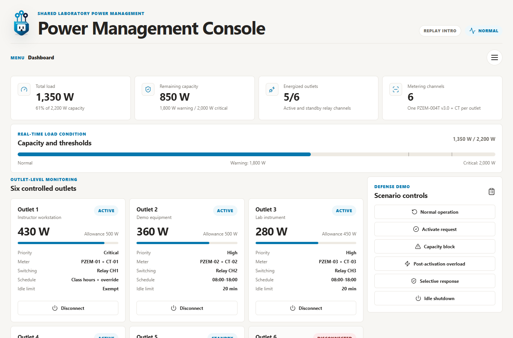

# Loadwise Power Management Dashboard

[](https://github.com/Ramenagii/mor-power-management-dashboard/actions/workflows/ci.yml)

Minimalist thesis defense dashboard for a context-aware power management extension. The app simulates outlet-level load monitoring, activation checks, overload response, idle shutdown policy, and event logging for a smart power strip or lab-scale controller.



## Features

- Live outlet cards with load, priority, status, and manual relay controls
- Capacity metrics for active outlets, current load, remaining headroom, and system state
- Scenario controls for pre-activation blocking, post-activation overload, selective load response, and idle shutdown
- Event log that records dashboard actions with info, success, warning, and critical severity
- Hardware and policy views for explaining the proposed system during a defense
- Reduced-motion-aware intro and UI motion built with Framer Motion

## Tech Stack

- React
- TypeScript
- Vite
- Framer Motion
- Lucide React

## Run Locally

```bash
npm install
npm run dev
```

## Build

```bash
npm run build
npm run preview
```

## Quality Gate

GitHub Actions runs install, audit, tests, and production build checks on pushes and pull requests.

## Project Notes

The dashboard is a front-end simulation for presentation and validation. It does not connect to physical relays, sensors, or embedded hardware yet. Hardware-facing work should add an API boundary before any direct device integration.

Wireframe and motion planning files live in [`docs/`](./docs).
